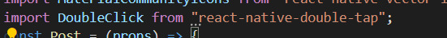
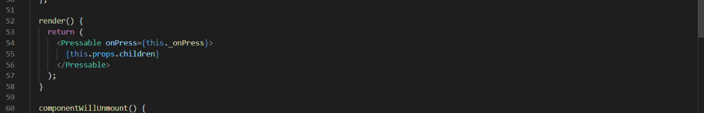

# Valentina

Created using React Native

# Installation 
1. Run `npm install` to install all the dependencies.
2. Go to this package definition by right clicking on it. 

3. In Line 54 of the definition, replace the **Touchable opacity** to **Pressable** 

